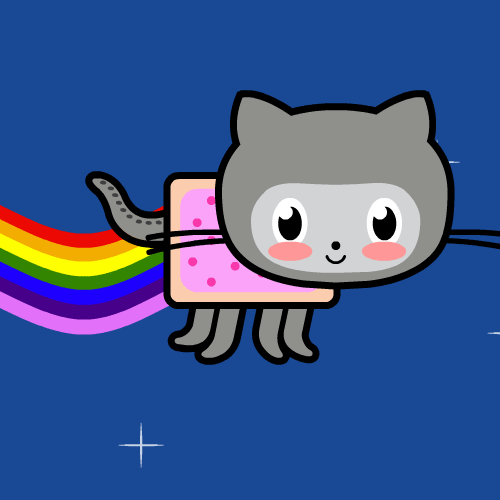

  

  <h1>Rifky Akhmad F.</h1>
  

    <strong>Fullstack Developer & IoT Enthusiast</strong>
     
    <em>Building things that matter from web apps to embedded systems</em>
  

  

    
  

---

## About Me

I am a passionate developer with experience across the full stack — from crafting REST APIs in **Go** and **Rust** to building interactive UIs with **Next.js** and **React**. I enjoy exploring new technologies, automating workflows, and occasionally tinkering with IoT hardware.

- Currently deepening skills in **TypeScript**, **Go**, and **Cloud Infrastructure**
- Experienced with **Laravel**, **Bun**, **Hono.js**, and **Actix Web**
- Interested in **AI integration**, **DevOps**, and **System Architecture**
- Love open source and building tools that make life easier

---

## Tech Stack

### Languages

### Frontend

### Backend

### Database

### Tools

---

## Featured Projects

### Web and API
- **Momentum** - AI-Powered Habit Tracker with Nuxt 4, Groq LLaMA, and GitHub-style heatmap
- **Next.JS 16 Project Engine** - Production-ready template with React 19 and TypeScript
- **Simple Inventory API** - Go-native REST API without frameworks
- **Simple Ticketing System** - Rust-based ticketing with Tokio + SQLx + PostgreSQL

### AI and Machine Learning
- **Simple Gemini Chatbot API** - Google Gemini AI chatbot powered by Bun + Express
- **Real-ESRGAN Video Upscaling** - Automated upscaling pipeline for Kaggle/Colab

### Mobile and IoT
- **InstaApp** - Full-stack social media clone (Laravel API + Next.js frontend)
- **Web IOT Inkubator** - Real-time incubator monitoring with WebSocket

---

## GitHub Stats

  
  

---

## Let's Connect

- Email: **rifkyakhmad911@gmail.com**
- GitHub: [RifkyA911](https://github.com/RifkyA911)

---

  Let's build something awesome together.

