

  

<h1 align="center">👋 Rifky Akhmad F.</h1>

  
  
  
  
  

  
  
  
  
  
  
  
  
  

---

## 📌 About Me

I write code across the full spectrum — from bare-metal C on microcontrollers to stateful UIs in React and stateless APIs in Go. I don't believe in lanes. I believe in building.

My toolbox covers **TypeScript**, **Go**, **Rust**, **PHP**, **Python**, and **JavaScript** — and I reach for whatever fits the problem. Results over religion.

🔹 Full-stack & systems builder  
🔹 Open source contributor  
🔹 Linux & self-hosting advocate  
🔹 Lifelong learner, serial project-starter  

---

## ⚡ My Approach

**Ship first. Iterate fast.**  
I'd rather launch a working 7/10 today than a perfect 10/10 next month. Every repo is both a product and a notebook.

**Pick the right tool.**  
No framework worship. TypeScript where it matters. Go for performance. Rust when safety is critical. PHP when the job calls for it.

**Understand the whole stack.**  
Database indexing, API design, frontend state, deployment — I keep the full picture in frame.

---

## 🛠️ Tech Stack

<table>
  <tr>
    <td align="center" width="96"> <b>JS</b></td>
    <td align="center" width="96">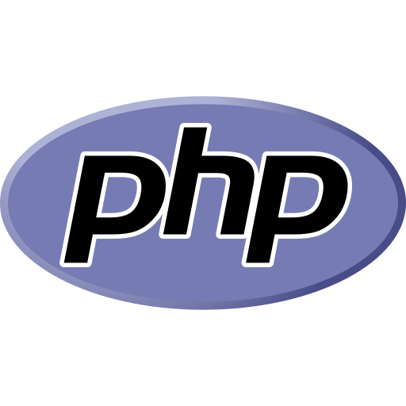 <b>PHP</b></td>
    <td align="center" width="96"> <b>Python</b></td>
    <td align="center" width="96">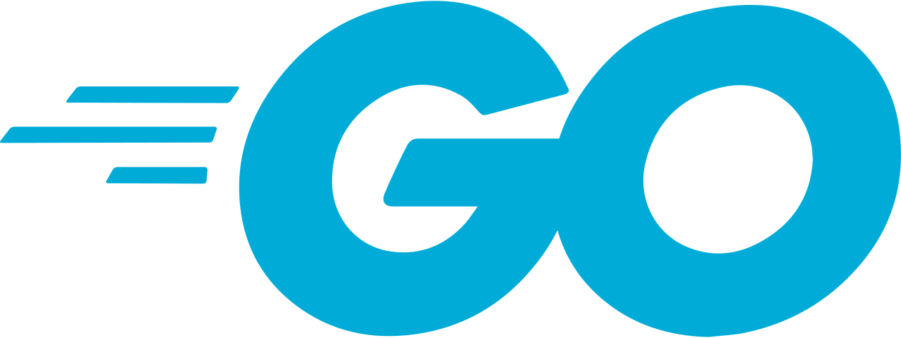 <b>Go</b></td>
    <td align="center" width="96"> <b>C++</b></td>
    <td align="center" width="96"> <b>C#</b></td>
    <td align="center" width="96">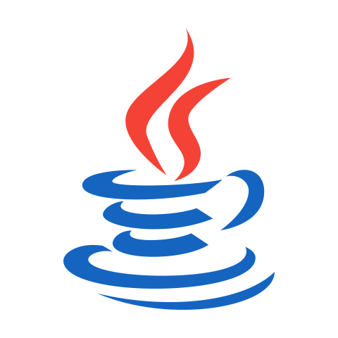 <b>Java</b></td>
    <td align="center" width="96">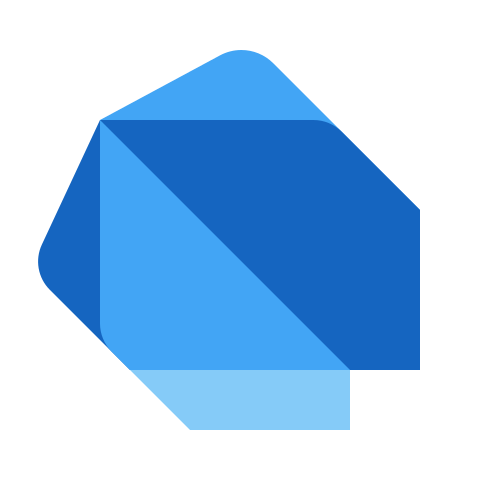 <b>Dart</b></td>
  </tr>
  <tr>
    <td align="center" width="96">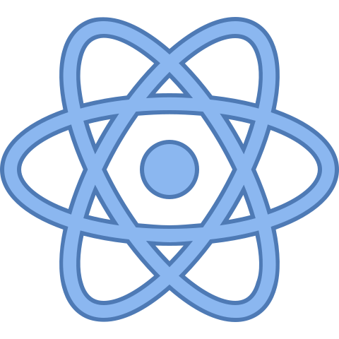 <b>React</b></td>
    <td align="center" width="96">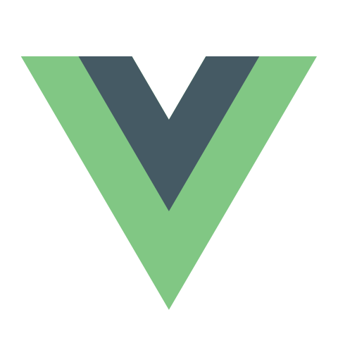 <b>Vue</b></td>
    <td align="center" width="96">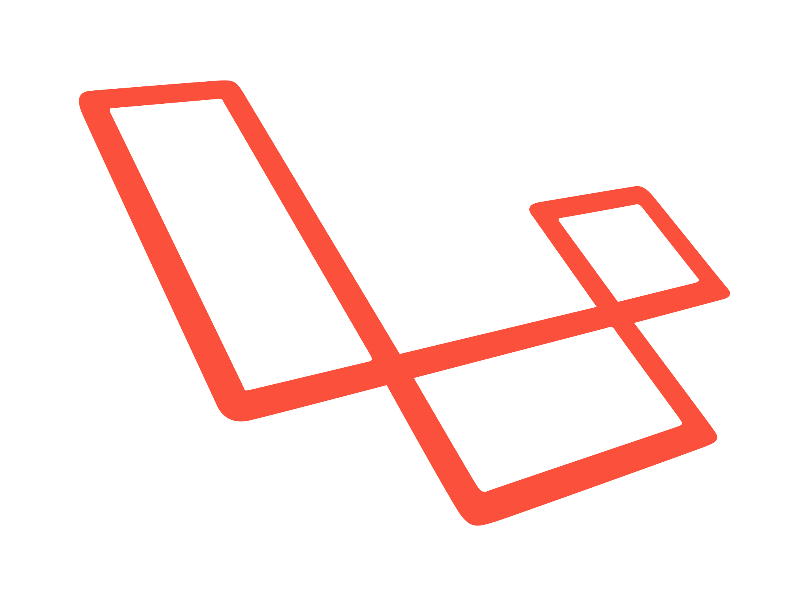 <b>Laravel</b></td>
    <td align="center" width="96">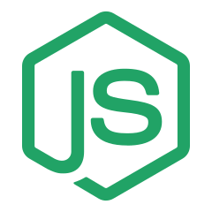 <b>Node.js</b></td>
    <td align="center" width="96">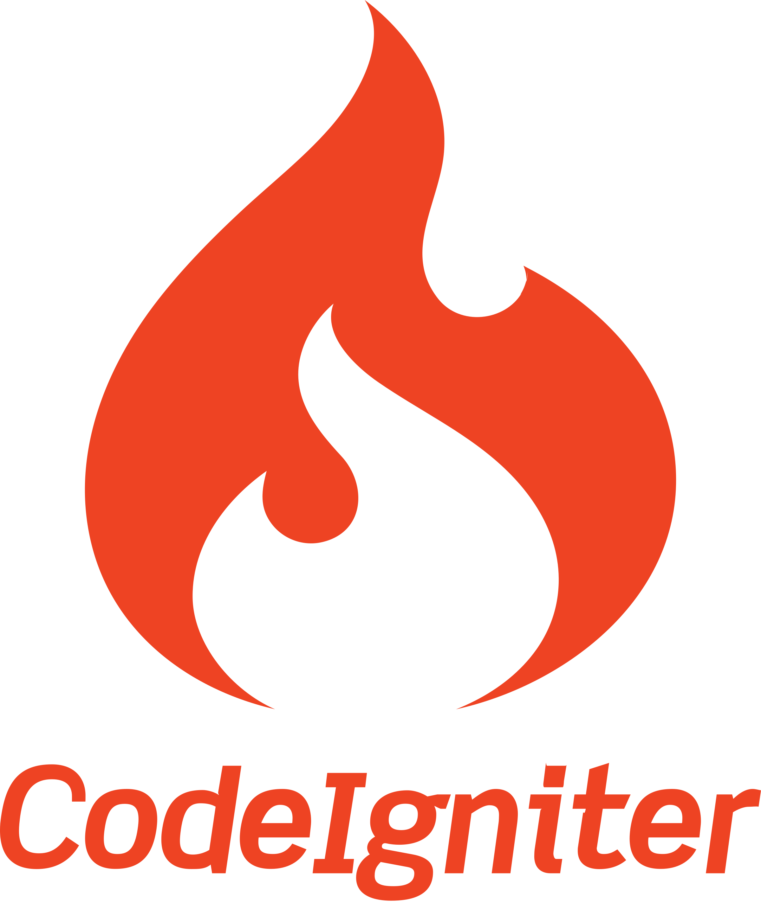 <b>CI</b></td>
    <td align="center" width="96">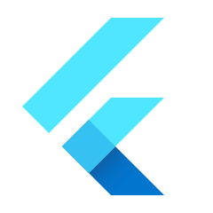 <b>Flutter</b></td>
    <td align="center" width="96">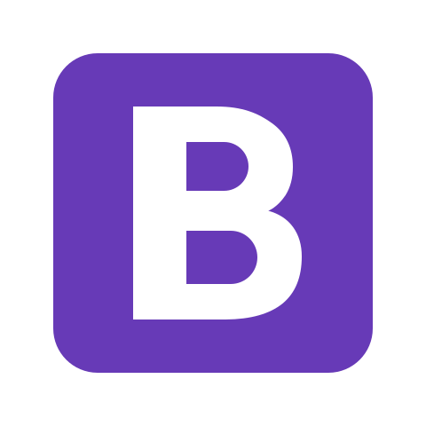 <b>Bootstrap</b></td>
  </tr>
  <tr>
    <td align="center" width="96"> <b>MySQL</b></td>
    <td align="center" width="96"> <b>MongoDB</b></td>
    <td align="center" width="96">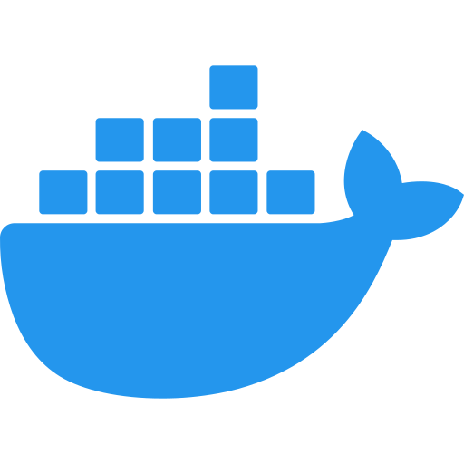 <b>Docker</b></td>
    <td align="center" width="96">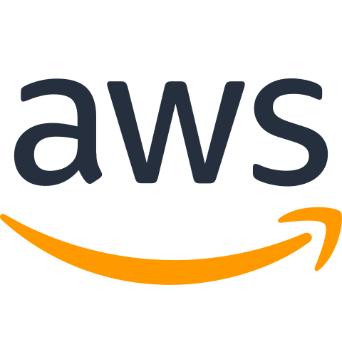 <b>AWS</b></td>
    <td align="center" width="96">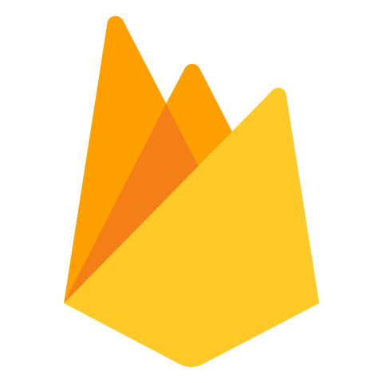 <b>Firebase</b></td>
    <td align="center" width="96">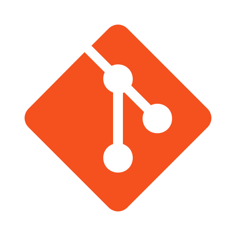 <b>Git</b></td>
    <td align="center" width="96">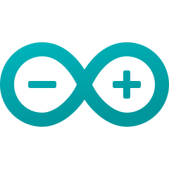 <b>Arduino</b></td>
  </tr>
</table>

---

## 📦 Highlights

- **Momentum** — AI habit tracker with Nuxt 4, Groq LLaMA, and behavioral analytics
- **Next.JS 16 Project Engine** — Production template with React 19
- **Simple Inventory API** — Go-native REST API, zero framework
- **Simple Ticketing System** — Rust + Tokio + SQLx + PostgreSQL
- **InstaApp** — Full-stack social clone (Laravel + Next.js)
- **Real-ESRGAN Upscaling** — AI video enhancement pipeline

---

## 📊 GitHub Stats

  
  

---

  📫 <a href="mailto:rifkyakhmad911@gmail.com">rifkyakhmad911@gmail.com</a> &nbsp;|&nbsp; 🐙 <a href="https://github.com/RifkyA911">github.com/RifkyA911</a>

