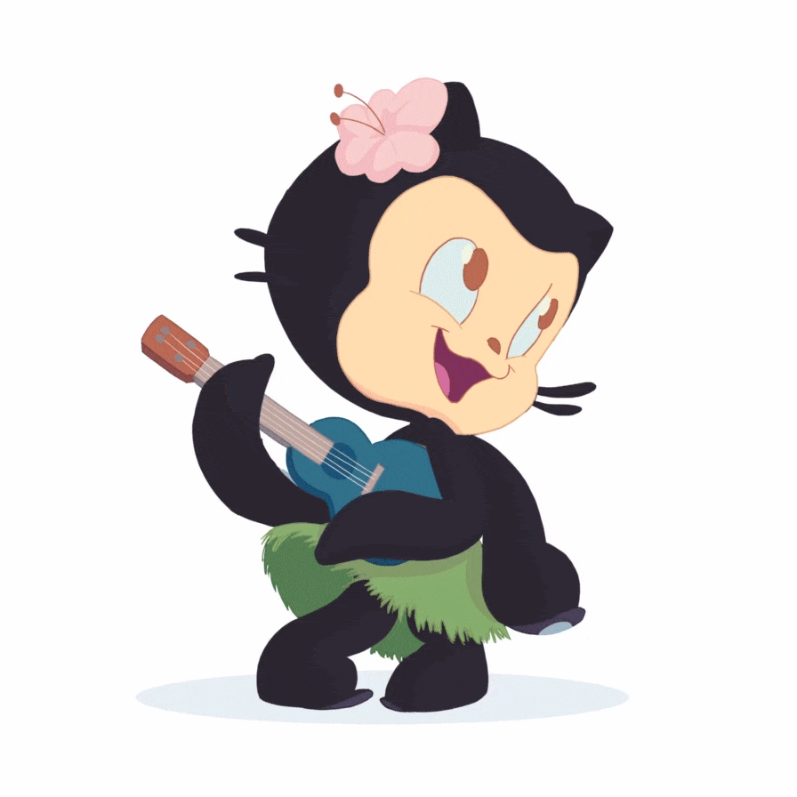

  

<h1 align="center">👋 Rifky Akhmad F.</h1>

  
  
  
  
  
  

---

## 🧑‍💻 About Me

Code. Coffee. Repeat. ☕

I'm a programmer who finds clarity in the quiet of late nights 🌙, where distractions fade and the real problem-solving begins. I thrive in **team environments** 🤝 — bouncing ideas during brainstorming sessions 🧠, debating architecture decisions 🏗️, and shipping solutions together.

I think beyond the syntax. **Business mindset** 💼 and **problem-solving** 🔍 drive every line I write. I'm passionate about **architecture & tech design** — figuring out how pieces fit together before writing a single line of code.

I'm constantly learning 🎯, researching new technologies 🔬, and running **experiments** 🧪 on the side. Whether it's a new framework, a different database, or a weird hardware project — I jump in and figure it out as I go. That curiosity is what keeps this fun.

---

## 🎯 My Approach

**Build, break, learn, repeat.** I learn fastest by doing — shipping real projects, breaking them intentionally, and fixing them better. Every experiment teaches more than any tutorial ever could.

**Architecture-first.** I plan before I code. Clean system design saves months of refactoring. I think in layers — data, logic, presentation, infrastructure — and make sure each one is solid before moving on.

**Full-spectrum thinking.** I don't stop at my lane. Understanding the backend helps me write better frontend. Knowing deployment helps me design better APIs. The wider your view, the fewer mistakes you make.

**Technology is a means, not an identity.** I pick the right tool for the problem. Not because it's trendy, but because it fits.

---

## 🛠️ Tech Stack

<table>
  <tr>
    <th colspan="8" align="center">Languages</th>
  </tr>
  <tr>
    <td align="center"> TS</td>
    <td align="center"> JS</td>
    <td align="center"> PHP</td>
    <td align="center"> Go</td>
    <td align="center"> Rust</td>
    <td align="center"> Python</td>
    <td align="center"> C++</td>
    <td align="center"> C#</td>
  </tr>
  <tr>
    <td align="center"> Java</td>
    <td align="center"> Dart</td>
    <td align="center"> Kotlin</td>
  </tr>
  <tr>
    <th colspan="8" align="center">Frontend</th>
  </tr>
  <tr>
    <td align="center"> Next.js</td>
    <td align="center"> React</td>
    <td align="center"> Vue</td>
    <td align="center"> Tailwind</td>
    <td align="center"> Bootstrap</td>
    <td align="center"> Flutter</td>
  </tr>
  <tr>
    <th colspan="8" align="center">Backend & Runtime</th>
  </tr>
  <tr>
    <td align="center"> Laravel</td>
    <td align="center"> Node.js</td>
    <td align="center"> Bun</td>
    <td align="center"> Hono</td>
    <td align="center"> CI</td>
    <td align="center"> Express</td>
  </tr>
  <tr>
    <th colspan="8" align="center">Database</th>
  </tr>
  <tr>
    <td align="center"> MySQL</td>
    <td align="center"> MongoDB</td>
    <td align="center"> PostgreSQL</td>
  </tr>
  <tr>
    <th colspan="8" align="center">Infrastructure & Tools</th>
  </tr>
  <tr>
    <td align="center"> Docker</td>
    <td align="center"> Git</td>
    <td align="center"> AWS</td>
    <td align="center"> Firebase</td>
    <td align="center"> Linux</td>
    <td align="center"> Arduino</td>
  </tr>
</table>

---

## 📦 Project Highlights

- **Momentum** — AI habit tracker with Groq LLaMA, Nuxt 4, and behavioral analytics
- **Next.JS 16 Project Engine** — Production-ready template with React 19 and Turbopack
- **Simple Ticketing System** — High-performance Rust backend (Tokio + SQLx + PostgreSQL)
- **InstaApp** — Full-stack social media clone (Laravel REST API + Next.js frontend)
- **Simple Gemini Chatbot** — Google Gemini AI agent powered by Bun + Express
- **Real-ESRGAN Upscaling** — Automated AI video enhancement pipeline
- **Web IOT Inkubator** — Real-time incubator monitoring over WebSocket

---

## 📊 GitHub Stats

  

  
  
  
  

---

  📫 <a href="mailto:rifkyakhmad911@gmail.com">rifkyakhmad911@gmail.com</a> &nbsp;·&nbsp; 🐙 <a href="https://github.com/RifkyA911">github.com/RifkyA911</a>

